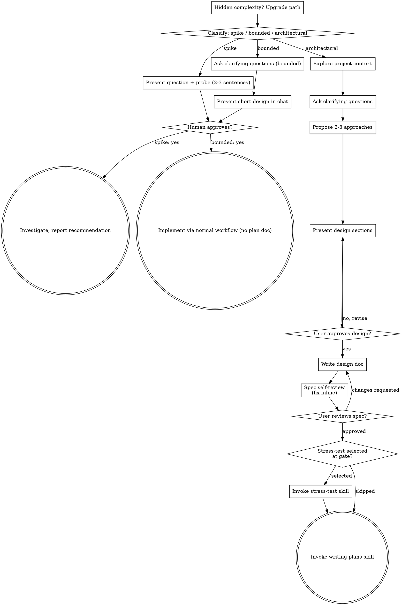

# Brainstorming Ideas Into Designs

Help turn ideas into fully formed designs and specs through natural collaborative dialogue.

Start by classifying how much process the request needs, then work
through your path: understand the context, refine the idea, present a
design, and get your human partner's approval.

## Establish Shared Understanding

The outcome of brainstorming is an understanding your human partner can
recognize and correct, grounded in what they want to accomplish.

1. **Discover intent.** Use the request and available context to identify
   the intended outcome, who it is for, and what success looks like. When
   that information is missing, ask one focused question about purpose or
   intended use before proposing features or an approach. Knowing the app
   genre does not tell you why your partner wants it. Gathering missing
   requirements does not ask them to authorize the task again.
2. **Write back your understanding.** Summarize the intended outcome,
   relevant constraints, and success criteria in a short note your partner
   can assess. Separate what they said from assumptions. Invite correction
   and incorporate their answer before treating this as the design brief.
3. **Carry intent into the design.** Preserve the agreed understanding in
   the selected path's design artifact: the written spec for architectural
   work, or the in-chat design/probe for bounded work and spikes. Check
   proposed features and technical choices against that understanding.

When the request already supplies the purpose and constraints, reflect
that understanding instead of asking the same questions again. Keep the
note concise; its accuracy and the opportunity to correct it matter.

<HARD-GATE>
Before taking any implementation action, including invoking an
implementation skill, writing product code, scaffolding, installing
product dependencies, or creating an external project, complete the
selected path's prerequisites:

- Spike: the human partner approves the question and probe.
- Bounded: the human partner approves the short in-chat design.
- Architectural: the human partner reviews and approves the written spec,
  then reviews the written implementation plan and selects its execution
  method. Conversational design approval only permits writing the spec;
  written-spec approval only permits invoking writing-plans.

A reply approves the stage actually presented. Approval of an idea or
feature scope does not approve artifacts that do not exist yet. Resume
at the earliest incomplete stage; do not turn one approval into permission
to skip the rest of the selected path. Read-only project exploration is
allowed while those prerequisites remain incomplete.
</HARD-GATE>

**Production-Grade Doctrine** applies with full force here — trade-offs are *first chosen* in brainstorming: you MUST NOT simplify a design by quietly cutting a required behavior; surface every material trade-off and let the user decide. Never weaken, bypass, or remove a security control — a security regression is never acceptable.

## Three Paths

Before your first question, classify the request and say the
classification out loud — "this looks bounded, so I'll present a short
design here rather than write a spec" — so your human partner can
override it:

- **Spike** — a feasibility question ("can we...", "is it possible...",
  "quick and dirty is fine") whose output is an answer, not code you
  keep. Present the question and what you'll try in 2-3 sentences, get
  a nod, then find out as cheaply as correctness allows. No design
  doc, no spec file. Report findings as a recommendation; anything you
  built stays labeled throwaway.
- **Bounded** — a well-scoped change to code that already exists in
  this repo: a new flag, a small endpoint, a one-file fix.
  Understanding the kind of app is not enough — bounded means the flow
  you are changing is already here to read. If there is no existing
  flow to change, the task is not bounded. Ask the clarifying
  questions that matter, present a short design IN CHAT (a few
  sentences to a few short paragraphs), and STOP. Implementation
  starts only after your human partner says yes to that design — a
  bounded task's approval is as hard a gate as an architectural
  one. No spec file, no implementation plan document.
- **Architectural** — new projects, new subsystems, changes that
  restructure how components fit together or alter interfaces others
  depend on. Follow the full process: questions, approaches, sectioned
  design, written spec, then the writing-plans skill.

When in doubt between two paths, take the heavier one. The ratchet is
one-way: hidden complexity discovered mid-task upgrades the path —
stop, say so, and step up. Nothing downgrades mid-task.

## Anti-Pattern: "Too Simple To Need Approval"

Every path ends with your human partner approving the required design
before implementation. A bounded change may need only two sentences in
chat. A new todo-list project is architectural and requires the written
spec and planning handoffs. Scale the artifact to the selected path;
complete that path's reviews before implementation.

## Red Flags

| Thought | Reality |
|---------|---------|
| "This is too simple to need a design" | Follow the selected path: a bounded change gets a short chat design; an architectural change gets the written spec and planning handoffs. |
| "I'll call it bounded and skip the spec" | Reaching for a label to skip work IS the doubt — take the heavier path. |
| "It's bounded and the design is obvious — I'll start while they read it" | The gate is the approval, not the design's length. Present, then stop until you hear yes. |
| "I understand this kind of app, so it's bounded" | Bounded measures the repo, not your familiarity. A new project has no existing flow — it is architectural. |
| "The spike works, so I'll keep the code" | A spike's output is an answer. Keeping the code is a new request — classify it. |
| "It grew, but I'm almost done — no need to re-classify" | Hidden complexity upgrades the path mid-task. Stop and say so. |
| "They approved the spike, so the follow-up change is approved too" | Each task gets its own classification and its own approval. |

## Checklist

Classify first, announce the path, then create a task for each item on
your path and complete them in order.

**Spike:**
1. **Explore project context** — enough to frame the probe
2. **Present question + probe plan** — 2-3 sentences
3. **Get approval** — a nod is enough
4. **Investigate** — as cheaply as correctness allows
5. **Report findings** — a recommendation; label anything built as throwaway

**Bounded:**
1. **Explore project context** — check files, docs, recent commits
2. **Ask clarifying questions** — one at a time, the ones that matter
3. **Present short design in chat** — approach, files touched, testing
4. **Get approval** — STOP and wait for an explicit yes; presenting the design and starting in the same breath is skipping the gate
5. **Implement** — proceed with the normal development workflow (TDD applies); no plan document

You MUST create the session bead + step children up front via `bd import`: first `bd create "Brainstorming: <topic>" -t task` (the permanent session bead — the audit trail; note its id), then author each checklist step as JSONL (one issue per line, `"issue_type":"chore"`, an explicit `"priority"`, `id` omitted, and a `parent-child` dep to the session id) and pipe to `bd import -`. Read `bd import --help` on first use; confirm the output shows no `Skipped dependency`. **Cleanup:** close each step bead as you complete it; if you abandon the brainstorm, close or `bd purge` the open steps (import children are permanent, not self-cleaning). Then complete the steps in order:

**Architectural:**
1. **Explore project context** — check files, docs, recent commits, and query the KB for prior decisions/research on the topic
2. **Offer the visual companion just-in-time** — NOT upfront. The first time a question would genuinely be clearer shown than described, offer it then (its own message); on approval its browser tab opens for you. If no visual question ever arises, never offer it. See the Visual Companion section below.
3. **Ask clarifying questions** — one at a time, understand purpose/constraints/success criteria
4. **Propose 2-3 approaches** — with trade-offs and your recommendation
5. **Present design** — in sections scaled to their complexity, get user approval after each section
6. **Write design doc** — save to `.internal/specs/YYYY-MM-DD-<topic>-design.md` and commit
7. **Spec self-review** — quick inline check for placeholders, contradictions, ambiguity, scope (see below)
8. **User reviews written spec** — ask user to review the spec file before proceeding
9. **Spec-review gate offers stress-test** — the spec-review gate (step 8) includes an "Approved + stress-test" option, offered every time; if selected, invoke `stress-test` before writing-plans
10. **Transition to implementation** — invoke writing-plans skill to create implementation plan

## Process Flow



**Terminal states are path-bound.** Architectural: after spec approval the only skills you may invoke are **stress-test** (optional, at the spec-review gate) then **writing-plans** — never frontend-design, mcp-builder, or any other implementation skill. Bounded: after approval, implementation proceeds directly through the normal development workflow; no plan document. Spike: the terminal state is a reported recommendation.

## The Process

The subsections below serve the bounded and architectural paths (a
spike stops at "present the probe, get a nod"). Sections from
**Exploring approaches** onward are architectural-path depth — for
bounded work, context plus a few questions plus a short in-chat design
is the whole process.

**Understanding the idea:**

- Check out the current project state first (files, docs, recent commits)
- Before proposing any design, query the knowledge store: `bd list --label <topic> --status all` + `bd search "<keywords>" --status all` + `bd memories <keyword>` (the memory half — lessons, patterns, root-causes; knowledge-beads alone miss it entirely) (body terms: add `--desc-contains "<term>"` — search matches titles only; >10 hits: narrow the query, never triage truncated titles). Then read — hits are pointers, not knowledge: `bd show <id1> <id2> ...` every hit that plausibly bears on this design (full bodies, never truncated below 50 lines; distilled <=2.5KB by design — sanctioned spend). 0 relevant does not mean none exist — re-angle the query once before emitting `KB check: none`. Emit `KB check: N bead hits, M memory hits, K read` (or `KB check: none`) plus a one-line disposition per read hit — folded in (what it changed) or ruled out (why). The check is complete when every plausibly-relevant hit is dispositioned. If a prior decision already covers this, surface it rather than re-litigating.
- Before asking detailed questions, assess scope: if the request describes multiple independent subsystems (e.g., "build a platform with chat, file storage, billing, and analytics"), flag this immediately. Don't spend questions refining details of a project that needs to be decomposed first.
- If the project is too large for a single spec, help the user decompose into sub-projects: what are the independent pieces, how do they relate, what order should they be built? Then brainstorm the first sub-project through the normal design flow. Each sub-project gets its own spec → plan → implementation cycle.
- For appropriately-scoped projects, ask questions one at a time to refine the idea
- Prefer multiple choice questions when possible — **use your structured question tool** for these (structured options are faster to answer than reading text and typing a response). Open-ended questions that don't have clear discrete options can remain as text.
- Only one question per message - if a topic needs more exploration, break it into multiple questions
- Focus on understanding: purpose, constraints, success criteria

**Exploring approaches:**

- Propose 2-3 different approaches with trade-offs
- **Use your structured question tool** to present the approaches as structured options. Put your recommended option first with "(Recommended)" in the label. Use the `description` field for trade-offs and reasoning. This is more efficient than text blocks that require the user to read and type a response.
- If approaches need detailed explanation beyond what fits in option descriptions, present the analysis as text first, THEN follow up with a structured question for the actual selection
- **YAGNI ruthlessly** - Remove unnecessary *speculative* features from all designs (never drop a required behavior, edge case, or security control — that is descoping, not YAGNI)

**Presenting the design:**

- Once you believe you understand what you're building, present the design
- Scale each section to its complexity: a few sentences if straightforward, up to 200-300 words if nuanced
- After presenting each section, **use your structured question tool** to check approval (content below; shape shown in Claude Code schema — adapt to your tool):
  ```json
  {
    "questions": [{
      "question": "Does the <section-name> section look right?",
      "header": "Design",
      "options": [
        {"label": "Looks good", "description": "Approve this section and move to the next one"},
        {"label": "Needs changes", "description": "I have feedback or revisions for this section"}
      ],
      "multiSelect": false
    }]
  }
  ```
- Cover: architecture, components, data flow, error handling, security, testing
- Be ready to go back and clarify if something doesn't make sense

**Design for isolation and clarity:**

- Break the system into smaller units that each have one clear purpose, communicate through well-defined interfaces, and can be understood and tested independently
- For each unit, you should be able to answer: what does it do, how do you use it, and what does it depend on?
- Can someone understand what a unit does without reading its internals? Can you change the internals without breaking consumers? If not, the boundaries need work.
- Smaller, well-bounded units are also easier for you to work with - you reason better about code you can hold in context at once, and your edits are more reliable when files are focused. When a file grows large, that's often a signal that it's doing too much.

**Working in existing codebases:**

- Explore the current structure before proposing changes. Follow existing patterns.
- Where existing code has problems that affect the work (e.g., a file that's grown too large, unclear boundaries, tangled responsibilities), include targeted improvements as part of the design - the way a good developer improves code they're working in.
- Don't propose unrelated refactoring. Stay focused on what serves the current goal.

## After the Design (architectural path)

**Documentation:**

- Write the validated design (spec) to `.internal/specs/YYYY-MM-DD-<topic>-design.md`
  - (User preferences for spec location override this default)
- Commit the design document to git

> When filing a bead for discovered/follow-up work, stamp it per **Agent-Filed Bead Discipline** (`verification-before-completion`).

After the work is settled, present the Capture gate — mandatory every time; Skip is the default (most work leaves nothing worth keeping):

```json
{
  "questions": [{
    "question": "Worth keeping anything from this?",
    "header": "Capture",
    "options": [
      {"label": "Skip", "description": "Nothing here outlasts the work itself (usually the case)"},
      {"label": "Record the decision", "description": "Pick this if the choice is hard to undo, non-obvious in hindsight, and had real trade-offs — so future-you knows why"},
      {"label": "Remember the lesson", "description": "A specific, evidence-backed lesson worth reusing in later sessions"},
      {"label": "Both", "description": "A lasting decision and a lesson worth reusing"}
    ],
    "multiSelect": false
  }]
}
```

Route on the answer. **Record the decision / Both** → this writes an ADR, so first confirm it clears the bar (hard-to-reverse AND surprising-without-context AND genuine trade-off); if it doesn't, say so and capture it as a memory instead (the lighter record) — unless the user confirms they want the full ADR. Write the ADR (`docs/decisions/ADR-NNNN-<kebab>.md`, sections Context/Decision/Rationale/Consequences, update `docs/decisions/INDEX.md`), then file a `type=decision` knowledge-bead so the decision stays retrievable: `printf '%s' "<distilled 0.5-2.5KB decision summary — context, decision, consequences>" | bd create "<one-line summary>" -t decision -l kb,adr-process,<topic> --defer 2099-01-01 --metadata "$(jq -nc --arg d "<ADR-path>" '{doc:$d}')" --body-file - --silent` (run the secret/PII scan on the summary first — flag for removal, never write a secret into a bead). **Remember the lesson / Both** → `bd remember "<kind>: <durable, evidence-backed insight>"`. **Skip** → nothing.

**Spec Self-Review:**
After writing the spec document, look at it with fresh eyes:

1. **Placeholder scan:** Any "TBD", "TODO", incomplete sections, or vague requirements? Fix them.
2. **Internal consistency:** Do any sections contradict each other? Does the architecture match the feature descriptions?
3. **Scope check:** Is this focused enough for a single implementation plan, or does it need decomposition?
4. **Ambiguity check:** Could any requirement be interpreted two different ways? If so, pick one and make it explicit.

Fix any issues inline. No need to re-review — just fix and move on.

**User Review Gate:**
After the spec review loop passes, **open the spec file in the user's editor** so they can review it, then gate progression with your structured question tool (content below; shape shown in Claude Code schema — adapt to your tool):

**User's preferred editor:** !`echo ${VISUAL:-${EDITOR:-not-configured}}`

**⚠️ Run the open command as a standalone Bash call** — never chain it after `bd` commands in the same invocation (e.g., `bd close <id> && open file.md`). The combination hangs.

```bash
# Open in user's preferred editor, with platform fallbacks
if [ -n "$VISUAL" ]; then
  "$VISUAL" "<spec-file-path>"
elif [ -n "$EDITOR" ]; then
  "$EDITOR" "<spec-file-path>"
elif command -v open >/dev/null 2>&1; then
  open "<spec-file-path>"
else
  xdg-open "<spec-file-path>" 2>/dev/null
fi
# If none available: just report the path
```

Then immediately ask via your structured question tool (content below; shape shown in Claude Code schema — adapt to your tool):

<!-- Canonical 3-option stress-test gate — keep identical to writing-plans/SKILL.md -->

```json
{
  "questions": [{
    "question": "Spec opened in your editor at `<path>`. Review it and let me know how to proceed.",
    "header": "Spec review",
    "options": [
      {"label": "Approved + stress-test (Recommended)", "description": "Spec looks good — run an adversarial stress-test before writing the plan"},
      {"label": "Approved", "description": "Spec looks good — skip stress-test and proceed to writing the implementation plan"},
      {"label": "Needs changes", "description": "I want to revise the spec before proceeding"}
    ],
    "multiSelect": false
  }]
}
```

Route on the answer:
- **Approved + stress-test** → invoke the `stress-test` skill with the spec path (`.internal/specs/YYYY-MM-DD-<topic>-design.md`) as the Mode-A artifact; when it completes, invoke `writing-plans`.
- **Approved** → invoke `writing-plans` directly.
- **Needs changes** → make the requested changes and re-run the spec review loop. Only proceed once approved.

**Implementation:**

- The stress-test offer now lives in the spec-review gate above (the "Approved + stress-test" option) — there is no separate stress-test prompt.
- Invoke the writing-plans skill to create a detailed implementation plan (after stress-test, if selected).
- Do NOT invoke any other skill besides stress-test (offered at the gate) and writing-plans.
- Pass the brainstorming bead context forward: the epic bead created during plan execution should reference the brainstorming session bead via `bd dep add <epic-id> <brainstorming-bead-id> --type discovered-from`

## Visual Companion

A browser-based companion for showing mockups, diagrams, and visual options during brainstorming. Available as a tool — not a mode. Accepting the companion means it's available for questions that benefit from visual treatment; it does NOT mean every question goes through the browser.

**Offering the companion (just-in-time):** Do NOT offer it upfront. Wait until a question would genuinely be clearer shown than told — a real mockup / layout / diagram question, not merely a UI *topic*. The first time that happens, offer it then for consent using your structured question tool. **This offer MUST be its own message.** Do not combine it with clarifying questions, context summaries, or any other content. If they decline, continue text-only and don't offer again unless they raise it.

```json
{
  "questions": [{
    "question": "This next part might be easier to show than describe. I can put together mockups, diagrams, and comparisons in a web browser as we go. This feature is still new and can be token-intensive. Want me to? (Requires opening a local URL)",
    "header": "Visual",
    "options": [
      {"label": "Yes, use visuals", "description": "Open a browser companion for mockups and diagrams during brainstorming"},
      {"label": "No, text only", "description": "Continue with text-based brainstorming in the terminal"}
    ],
    "multiSelect": false
  }]
}
```

Wait for the user's response before continuing. If they decline, proceed with text-only brainstorming.

**Per-question decision:** Even after the user accepts, decide FOR EACH QUESTION whether to use the browser or the terminal. The test: **would the user understand this better by seeing it than reading it?**

- **Use the browser** for content that IS visual — mockups, wireframes, layout comparisons, architecture diagrams, side-by-side visual designs
- **Use the terminal** for content that is text — requirements questions, conceptual choices, tradeoff lists, A/B/C/D text options, scope decisions

A question about a UI topic is not automatically a visual question. "What does personality mean in this context?" is a conceptual question — use the terminal. "Which wizard layout works better?" is a visual question — use the browser.

If they agree to the companion, read the detailed guide before proceeding:
`skills/brainstorming/visual-companion.md`

## Integration

**Invokes:**
- **stress-test** *(optional)* — offered at the spec-review gate every time (the "Approved + stress-test" option), before writing-plans.
- **writing-plans** — terminal state. The only implementation skill brainstorming invokes.
