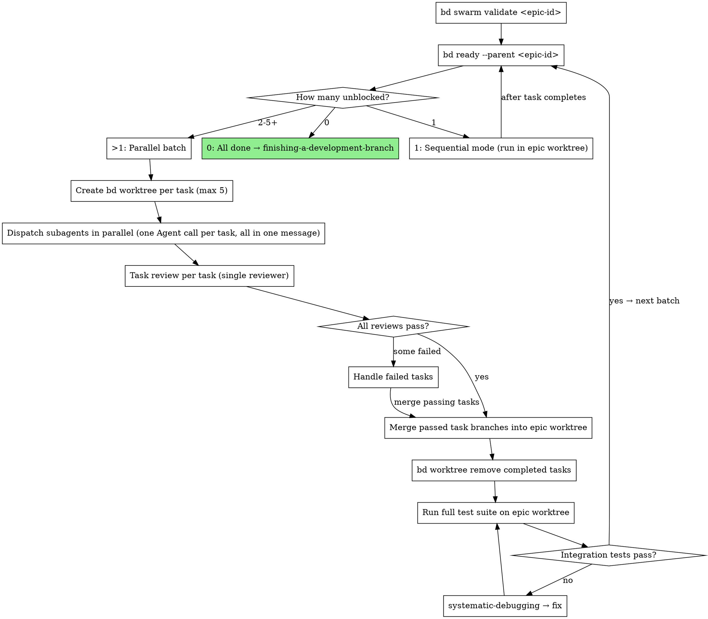

## Parallel Batch Mode

When `bd ready --parent <epic-id>` returns multiple unblocked tasks, those tasks have no dependencies between them and can execute in parallel — each in its own isolated `bd worktree`.

**Core principle:** One `bd worktree` per task + parallel dispatch = safe concurrency with per-task rollback.

**Parallel cap:** Maximum 5 subagents per batch. If more tasks are unblocked, split into batches of 5.

### Before you fan out (orchestrator-only)

Worktrees isolate *files*, not *assumptions* — parallel agents on different files can still diverge on an un-prescribed shared decision (MAST FC2). Before dispatching:

1. **Front-load shared decisions** — list every decision ≥2 agents depend on (schemas, naming, interfaces, conventions); decide each once and write it verbatim into *every* agent prompt.
2. **Share full context, not summaries** — give each agent the relevant traces/facts, not a lossy digest.

This is orchestrator discipline applied before dispatch; do not ask subagents to coordinate with each other.

### Batch Execution Flow



### Parallel Batch Walkthrough

```
1. Orchestrator creates epic worktree (once, at the start):
     bd worktree create .worktrees/<epic-name>

2. Analyze the work graph before dispatching:
     bd swarm validate <epic-id>
     → Shows wave structure (which tasks can run concurrently vs sequentially),
       max parallelism, estimated worker-sessions, and dependency warnings.
     Use this to plan batch sizes and catch missing dependencies before
     wasting subagent runs on tasks that will block.

3. Get unblocked tasks:
     bd ready --parent <epic-id>
     → Returns N tasks with no unresolved dependencies

4. If N > 1 (parallel batch, cap at 5 per batch):
   For each task in the batch:
     bd worktree create .worktrees/<task-name> --branch feature/<epic>/<task>

5. Dispatch all subagents in parallel:
   Read ./implementer-prompt.md, then one Agent tool call per task, ALL in the same message:
     Agent({
       description: "Implement Task N: <name>",
       prompt: "<implementer-prompt content with 'Work from: <task-worktree-path>'>",
       subagent_type: "general-purpose"
     })

6. Task review per task (can also run in parallel):
   Dispatch the single task reviewer (./task-reviewer-prompt.md) with the task
   brief, the implementer's report file, and the review-package diff. It returns
   a spec-compliance verdict (✅/❌/⚠️) and a code-quality verdict in one pass.

7. For each task that passes review:
     cd .worktrees/<epic-name>
     git merge feature/<epic>/<task>
     bd worktree remove .worktrees/<task-name>
     bd close <task-id> --reason "Completed: reviews passed"

8. Run full test suite on epic worktree (integration check):
   If fail → invoke systematic-debugging → fix before next batch

9. Re-run bd ready --parent <epic-id>
   Repeat from step 3 until no tasks remain

9. If N == 1 at any point:
   Sequential mode — run in epic worktree directly, no per-task worktree needed
```

> **Tip:** Use `bd -C .worktrees/<task> ready` to check task status across worktrees without changing directory.

> **Concurrent orchestrators (optional — `bd merge-slot`):** Step 7's merges run through a single orchestrator, one at a time, so the normal flow has no merge race and needs no coordination. The exception is when **two or more orchestrators or sessions** run SDD concurrently against the same repo (overlapping epics) — their merges into the shared base could collide. For that case only, serialize merges with the beads v1.0.5 merge slot: `bd merge-slot create` once for the repo, then wrap each task merge as `bd merge-slot acquire` → `git merge feature/<epic>/<task>` → `bd merge-slot release`, so only one orchestrator resolves conflicts at a time. Pairs with the `bd swarm validate` pre-step above.

### Failed Task Handling

When a parallel task fails review:

1. **Do not merge** its task branch into the epic branch.
2. **Option A — Fix rounds:** Keep the task worktree and run **`## Fix Rounds` / `## The Breaker`** below, unchanged: five-round cap, a FRESH implementer every round, scoped re-review via `./re-review-prompt.md`, PASS gated on a green full suite. Parallel mode gets no unbounded loop.
3. **Option B — Discard:** not a controller call. Discarding a failed task's branch (`bd worktree remove .worktrees/<task-name>`) is a disposition **the user** decides — surface it per `references/breaker-trip.md`; never adjudicate it yourself.
4. Other parallel tasks that passed review are still merged independently — one failure does not block the batch.

### Mode Selection

```
tasks = bd ready --parent <epic-id>

if len(tasks) == 0:
    All done → invoke finishing-a-development-branch
elif len(tasks) == 1:
    Sequential mode (run in epic worktree, existing behavior)
elif len(tasks) <= 5:
    Parallel batch (one bd worktree per task)
else:
    Take first 5 → parallel batch, remaining wait for next iteration
```

Mode selection is automatic. The orchestrator checks after every batch or sequential task completes.


